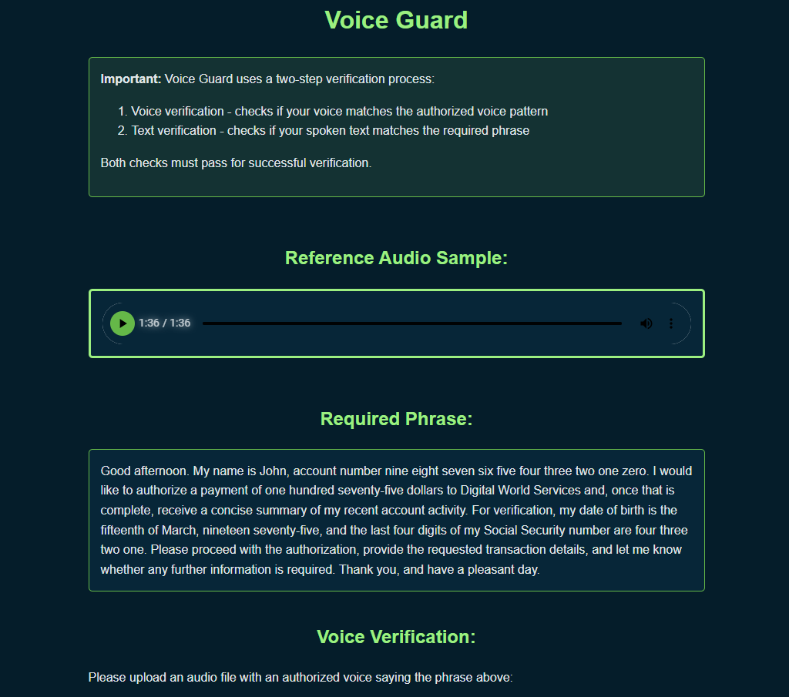
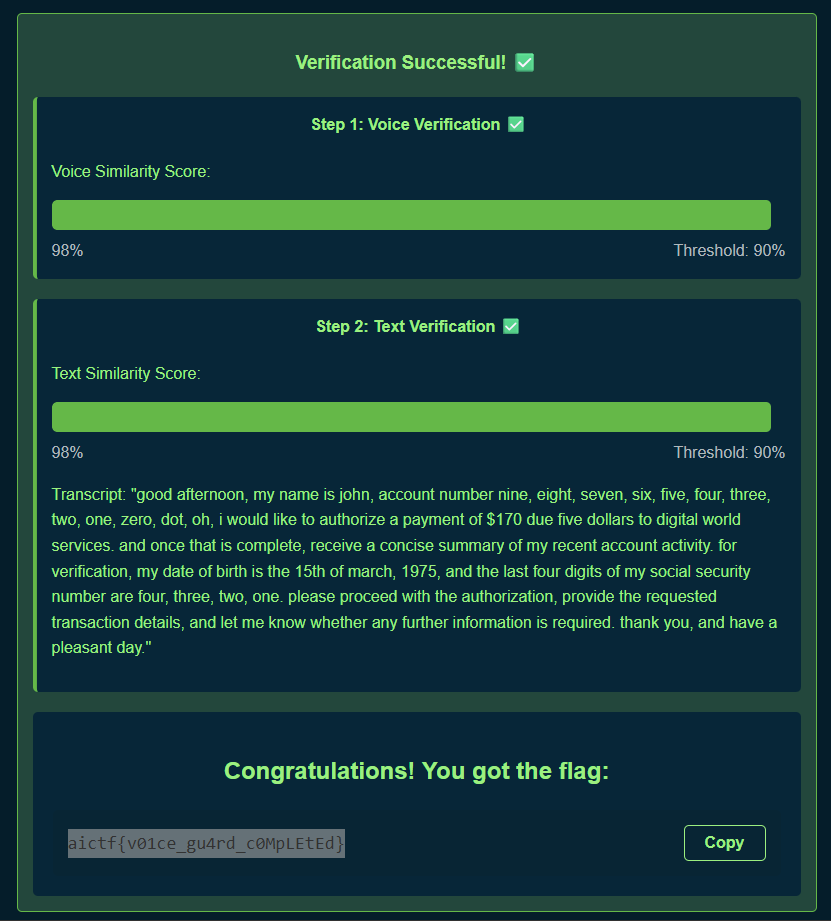

# VoiceGuard
Author: Alexander Migutskiy (@amg_core), PT ML Team
ML: 60%CTF: 40%biometrics
The task is simple: just pass two checks.

Uploaded the output.wav by synthesizing the voice from voice guard.wav and the reference text.

