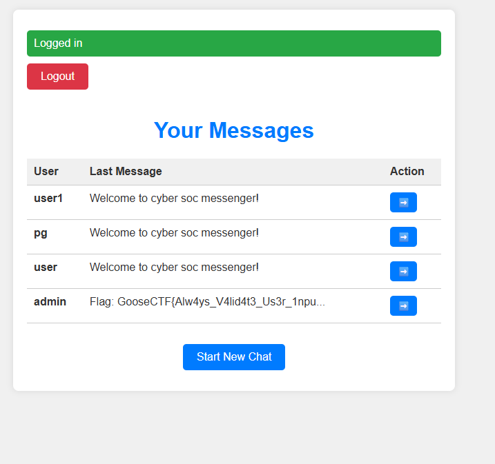

# Messenger
Difficulty: Medium

The intern created this messaging app for Cyber Socs' internal communications.
Our secrets got leaked on the dark web!!!
Try and find the vulnerability the attacker exploited.


```py
@app.route('/set-password', methods=['GET', 'POST'])
def set_password():
    if request.method == 'POST':
        username = request.form['username']
        code = request.form['code']
        password = request.form['password']
        conn = sqlite3.connect('database.db')
        c = conn.cursor()
        c.execute('SELECT expiry FROM reset_codes WHERE code = ?', (code,))
        result = c.fetchone()
        if result is None:
            flash('Invalid reset code', 'error')
            return redirect('/set-password')
        if result[0] < int(time.time()):
            flash('Reset code has expired. Please request a new one', 'error')
            return redirect('/reset-password')
        c.execute('UPDATE users SET password = ? WHERE username = ?', (hash_password(password), username))
        c.execute('DELETE FROM reset_codes WHERE code = ?', (code,))
        conn.commit()
        conn.close()
        flash('Password reset', 'success')
        return redirect('/login')
    # Get username from session
    if 'reset_username' in session:
        return render_template('set_password.html', username=session['reset_username'])
    else:
        return redirect('/reset-password')
```

In the above code snippet, while resetting the password, only one thing is checked that whether the reset code is valid or not, it is not checked to whom the reset code is associated to.

So, we can:
1. Sign up with the 1337@warwickcybersoc.com email with our own username: `user1`.
2. Verify the email.
3. Reset the password for this user: `user1`
4. Reset the password fro the admin account.
5. Use the reset code of `user` for the `admin` account.
6. We get access to the admin account.
7. The flag can be seen in the `/messages` route.

