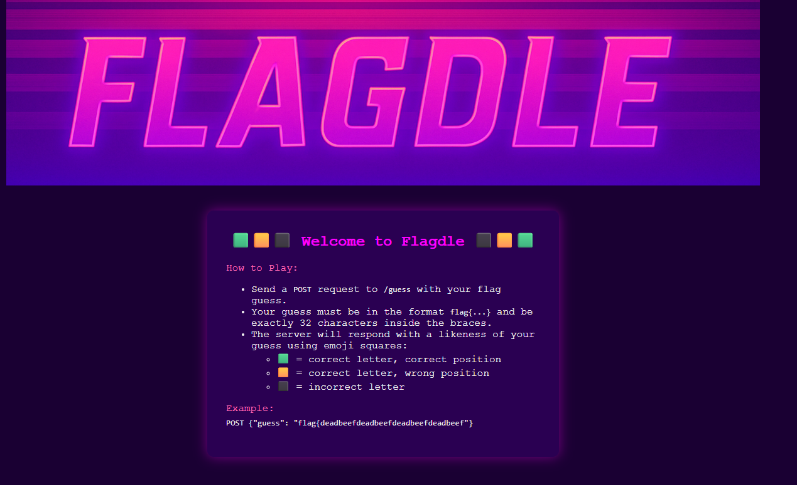

Author: @HuskyHacks

Wordle? I sleep. Too easy.

32 character Wordle? Now we're cooking with gas!

The logic for this is simple:

Since the flag only contains data from 0-9a-f, we can just bruteforce all the letters, so we will have the complete flag in atmost 15 moves.

Asked chatgpt to quickly prototype this and got the flag:

