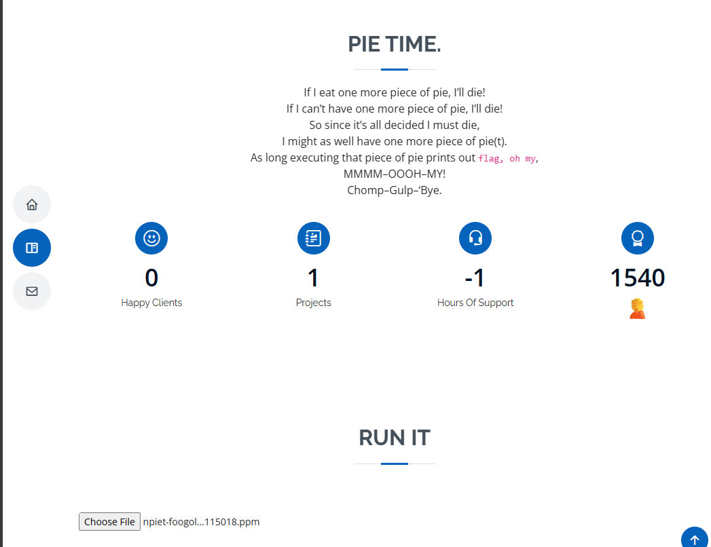
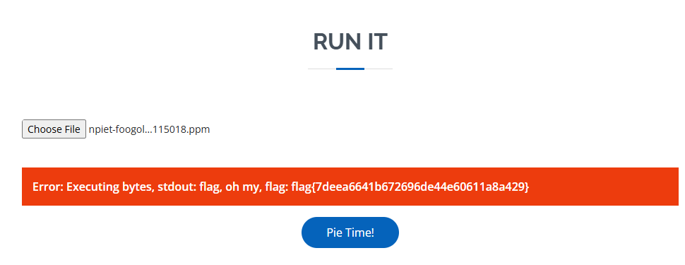

# I Want Pie

Author: @kkevsterrr

If I eat one more piece of pie, I'll die!
If I can't have one more piece of pie, I'll die!
So since it's all decided I must die,
I might as well have one more piece of pie.
As long executing that piece of pie prints out `flag, oh my`,
Chomp---Gump---'Bye.


Opening the webpage reveals a upload button where we can upload some files.



By default it is accepting .pngs only. I tried to upload a random png and got a message saying that it likes ppm files.

After doing some research on the text given, I realized that it is referring to the piet language.
https://www.dangermouse.net/esoteric/piet/samples.html

I converted some of the images here to ppm and uploaded to the tool, and it showed the output of these programs.

After some more researching, I got to npiet which is an interpreter for piet. Luckily, it also has a foogol to piet compiler.

So I can write foogol code to print the required text: `flag, oh my`.

```sh
echo 'begin prints ("flag, oh my") end' | ./prog - && ./npiet prog.png
output saved to prog.png
flag, oh my
```

Converted the png to a ppm file and uploaded.

Got the flag: 

