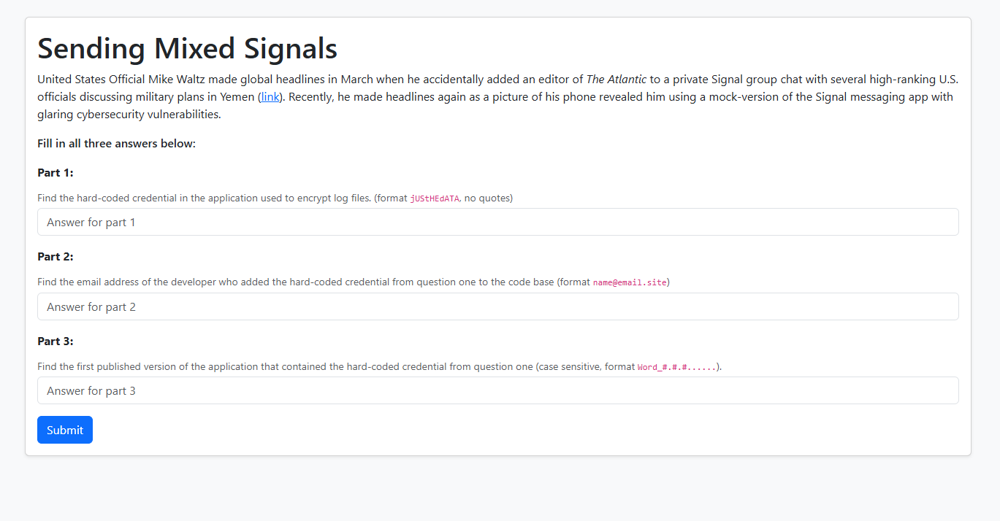
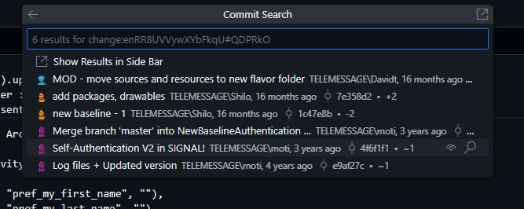
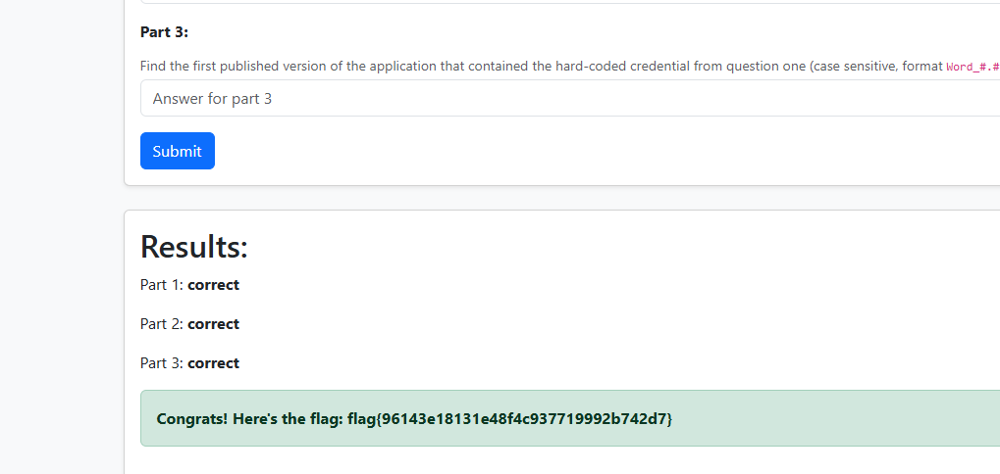

# Sending Mixed Signals
Author: @Jstith

Turns out the Houthi PC Small Group was only the tip of the iceberg...

Visting the website:

On searching on this, I stumbled upon this article:
https://micahflee.com/heres-the-source-code-for-the-unofficial-signal-app-used-by-trump-officials/

And this repository:
https://github.com/micahflee/TM-SGNL-Android/

Find the hard-coded credential in the application used to encrypt log files. (format jUStHEdATA, no quotes)
enRR8UVVywXYbFkqU#QDPRkO

On searching for commits with the change:

Find the email address of the developer who added the hard-coded credential from question one to the code base (format name@email.site)
moti@telemessage.com

Find the first published version of the application that contained the hard-coded credential from question one (case sensitive, format Word_#.#.#......).
Release_5.4.11.20

