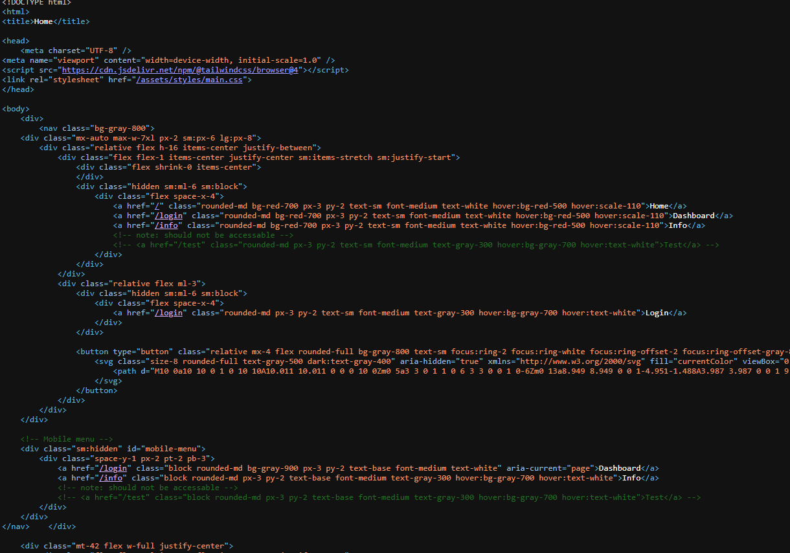
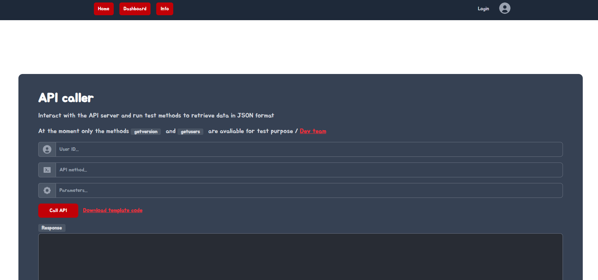

# Outcast

Author: YesWeHack

YesWeHack has provided this CTF challenge, and they state: "This challenge is meant to be run as a black-box environment. The source code is intentionally not provided."

Light enumeration is permitted for this challenge.

On viewing the source of the webpage, /test endpoint is discovered.




On clicking download template code:
/modules/apicaller.php.orig
```
<?php

class APICaller {
	private $url =  'http://localhost/api/';
	private $path_tmp = '/tmp/';
	private $id;

	public function __construct($id, $path_tmp = '/tmp/') {
		$this->id = $id;
		$this->path_tmp = $path_tmp;

	}

	public function __call($apiMethod, $data = array()) {
		$url = $this->url . $apiMethod;
		$data['id'] = $this->id;

		foreach ($data as $k => &$v) {
			if ( ($v) && (is_string($v)) && str_starts_with($v, '@') ) {
				$file = substr($v, 1);

				if ( str_starts_with($file, $this->path_tmp) ) {
					$v = file_get_contents($file);
				}
			}
			if (is_array($v) || is_object($v)) {
				$v = json_encode($v);
			}
		}

		// Call the API server using the given configuraions
		$ch = curl_init($url);
		curl_setopt_array($ch, array(
			CURLOPT_POST           => true,
			CURLOPT_POSTFIELDS     => $data,
			CURLOPT_RETURNTRANSFER => true,
			CURLOPT_HTTPHEADER     => array('Accept: application/json'),
		));
		$response = curl_exec($ch);
		$error  = curl_error($ch);
		
		curl_close($ch);

		if (!empty($error)) {
			throw new Exception($error);
		}

		return $response;
	}
}
```

On visiting /modules/, there's also a /modules/apicaller.php